# Assignment 2

Student name: Alibayev Danial

Group: IT-2504

Part1: Logical Data Structures

Task 1. Bank Account Storage Using Linked List

DATA STRUCTURE: Linked List.

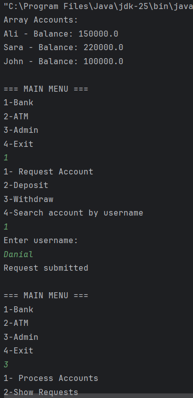

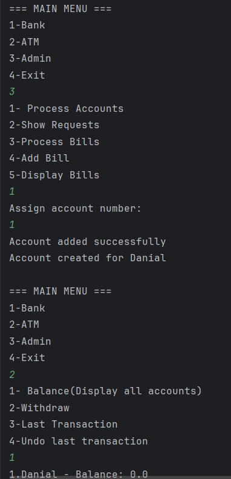

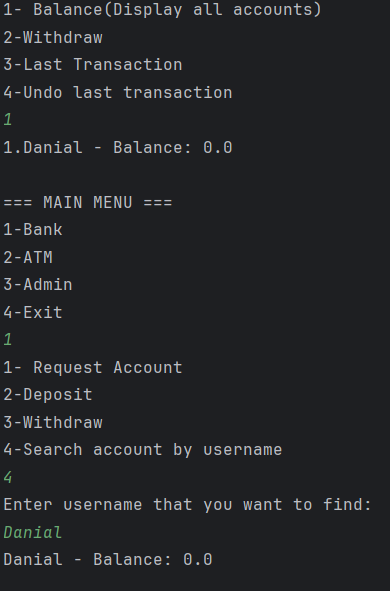

Task 2. Deposit and Withdraw operations

DATA STRUCTURE: Linked List.

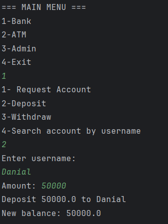

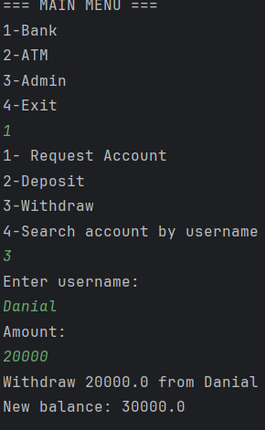

Task 3. Transaction History (Stack - LIFO)

DATA STRUCTURE: Stack.

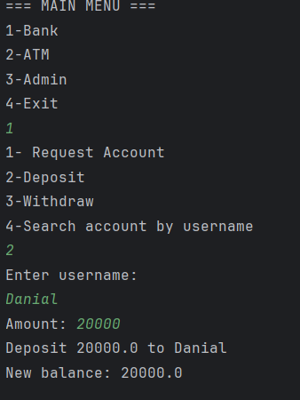

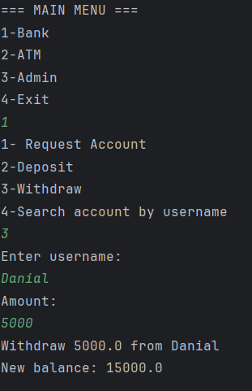

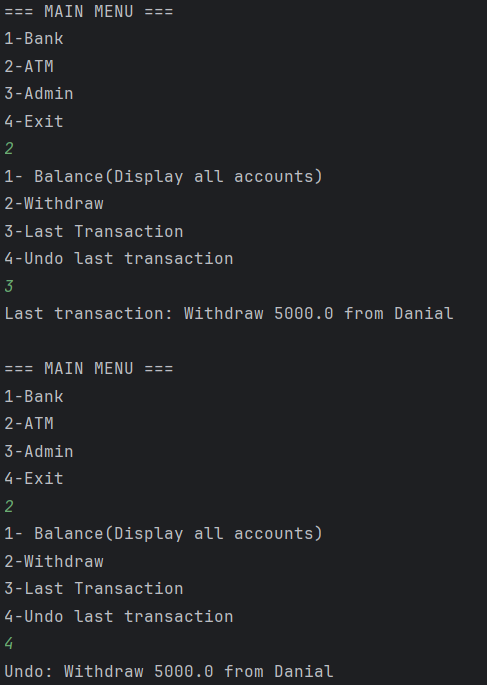

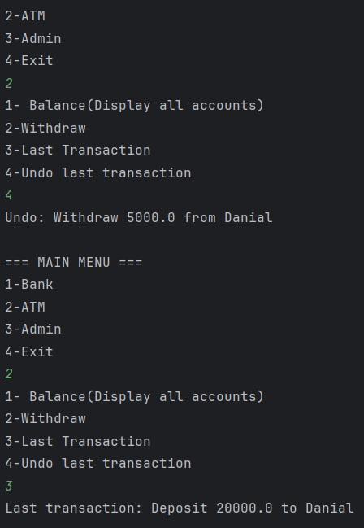

Task 4. Bill Payment Queue (Queue - FIFO)

DATA STRUCTURE: Queue.

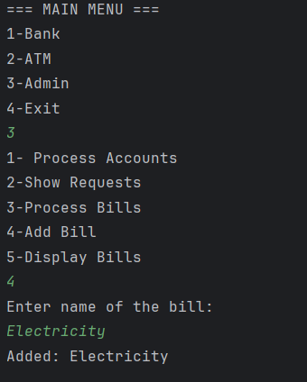

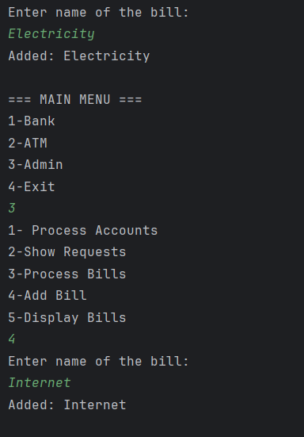

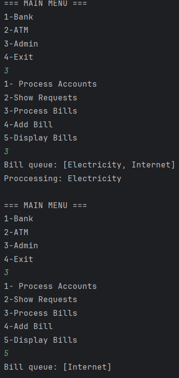

Task 5. Account Opening Queue (Admin Simulation)

DATA STRUCTURE: Queue.

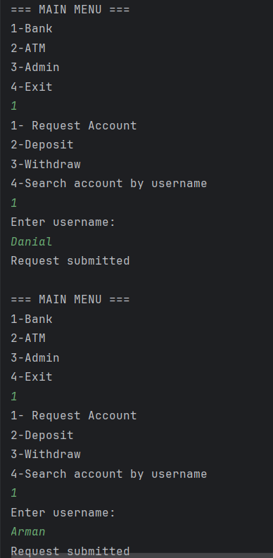

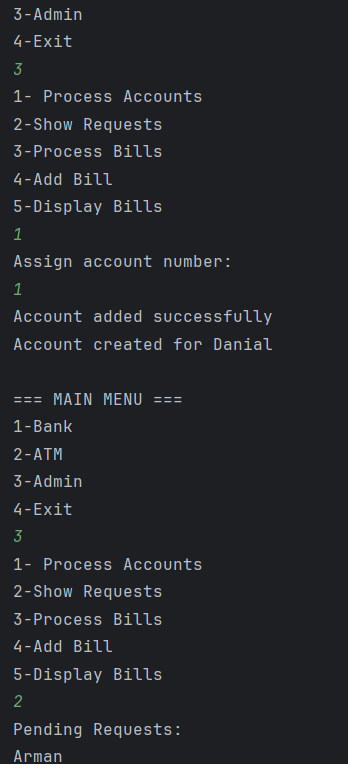

Part 2: Physical Data Structures

Task 6. Creating array

DATA STRUCTURE: Array.

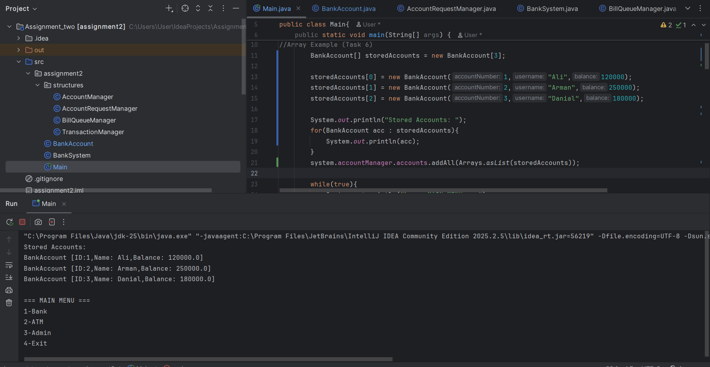

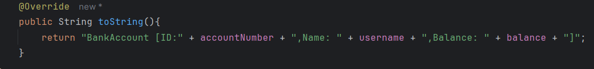

Part 3: Mini Banking Menu

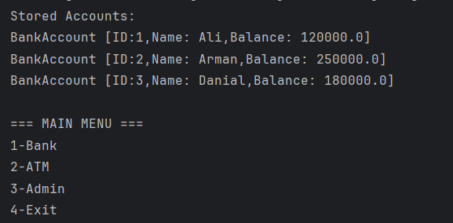

Brief Summary of the works process:

1)Creating BankAccount class with 3 attributes.

2)Creating 4 classes for each data structure. AccountManager uses LinkedList. BillQueueManager and AccountRequestManager uses Queue(FIFO). TransactionManager uses Stack(LIFO).

3)Creating BankSystem class to connect each class. Creating Main class as Mini Banking Menu.  
